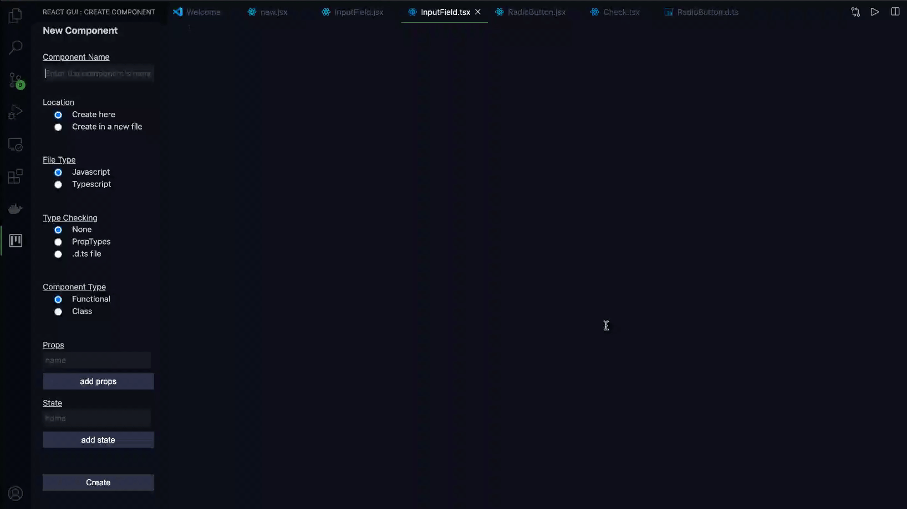

<h1 align="center">React GUI</h1>

  <strong>A blazingly fast way to bootstrap react components</strong>
  
Create your react components quickly & easily with a straightforward GUI

---

## Demo

    

## Installation

## Usage

1. Component creation -
   Open the component creation form from sidebar and fill it up as shown in the above demo.
   Click create and get started with producing logic for your component, without worrying about
   boilerplate.
2. Definition file initialization -

   - Highlight a list of props that you want to create a definition file (.d.ts) from.
   - Press ctrl+shift+p and search `Initialize Definition File`.
   - Press the `React GUI: Initialize Definition File` option.

   **eg:** You may highlight the props from lists like the following. The highlighted text in
   the following cases must be `label, placeholder, value`.

   1. `const {label, placeholder, value} = this.props;`
   2. `const InputField = ({label, placeholder, value}) =>`

## Built Using

- Typescript
- Svelte
- HTML/CSS
- Yo

## Steps to run locally

- Clone the repo using `git clone https://github.com/Pradeep-selva/react-gui`.
- install dependencies using `yarn` or `npm install`.
- Run `yarn watch` in your root directory.
- In your root directory press f5 and select `npm compile`.

## License

[MIT](LICENSE) © [Pradeep-selva](https://github.com/Pradeep-selva)
